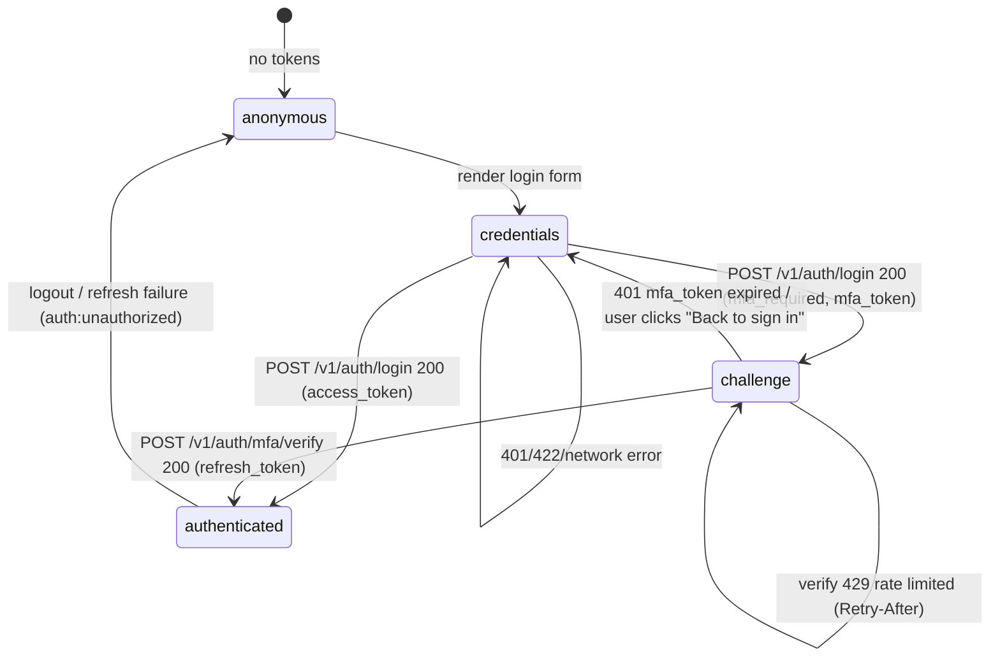
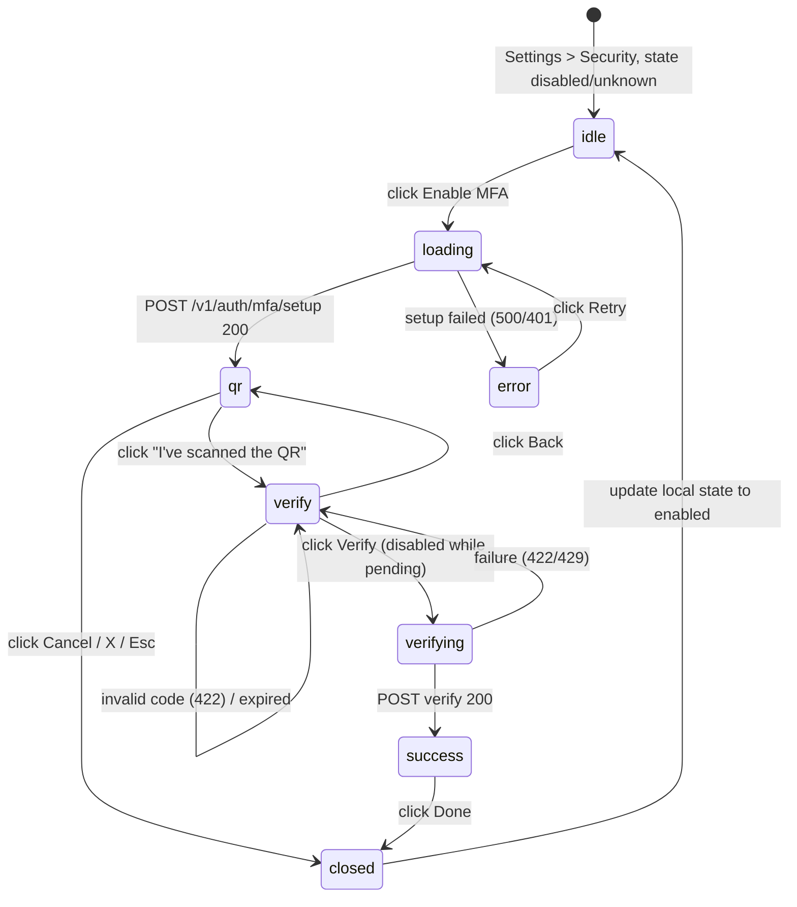
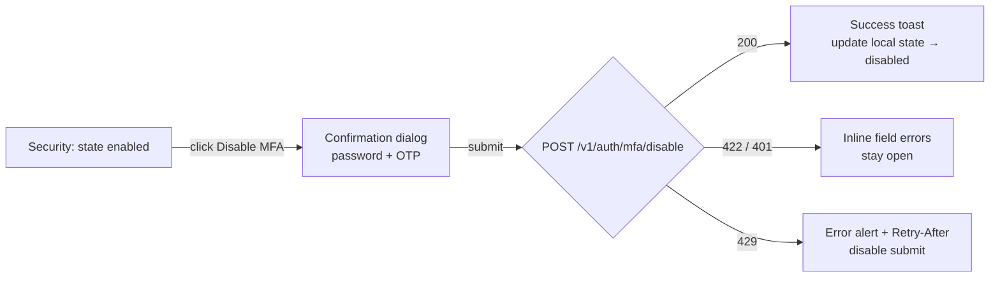
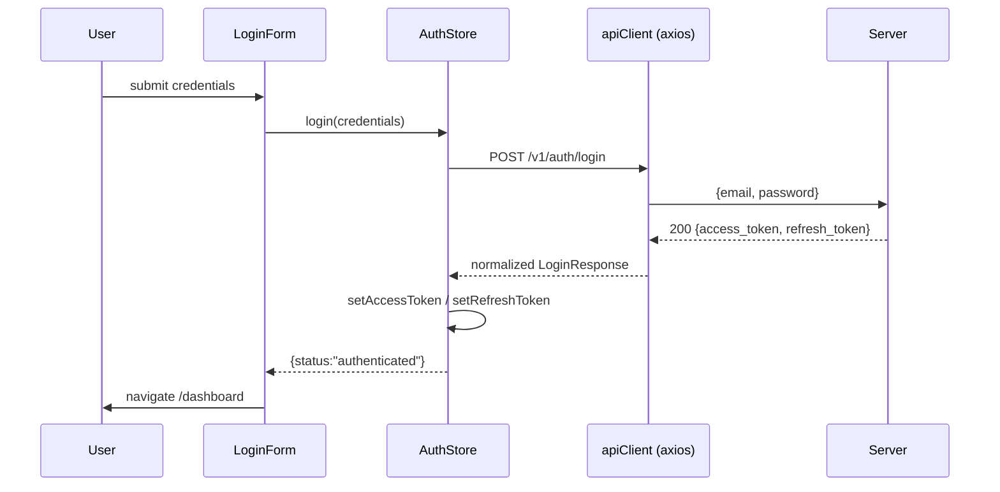
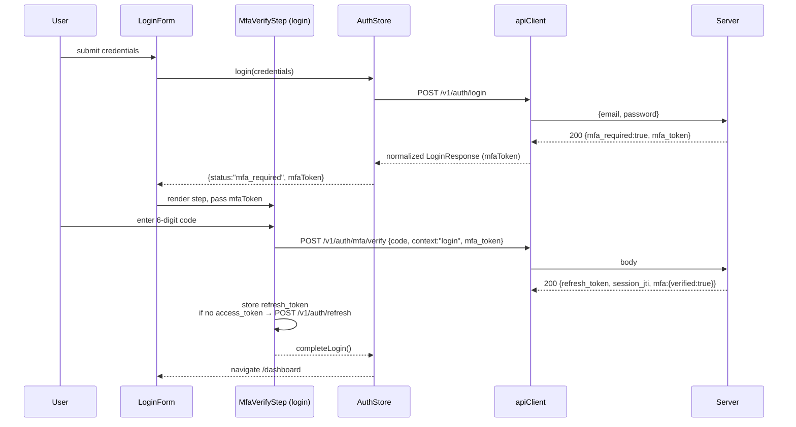
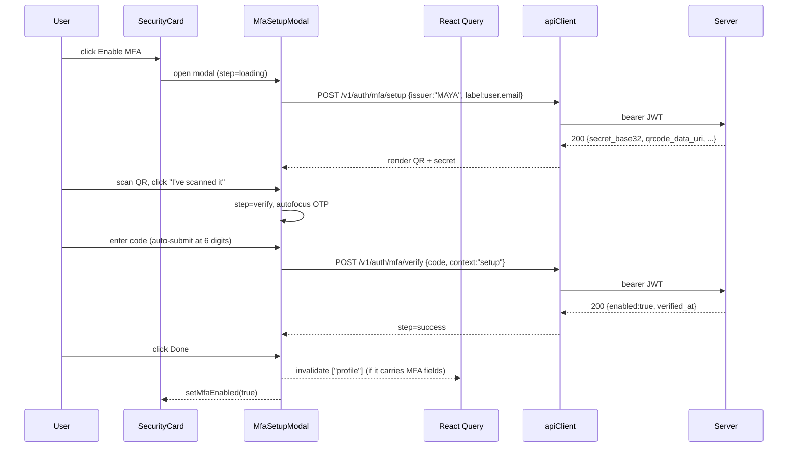
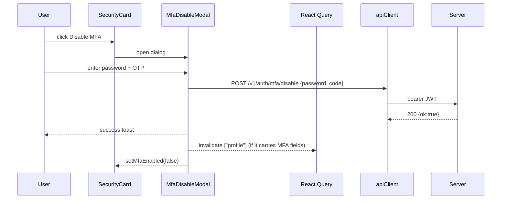

# MFA (TOTP) Frontend Integration Plan — MAYA

**Status:** Ready for implementation · **Scope:** Frontend only (`frontend/` workspace) · **Target stack:** React 19, TypeScript, Vite, axios, React Router v8, TanStack Query, React Hook Form + Zod, Tailwind CSS 4, @base-ui/react, lucide-react

---

## 1. Overview

This plan integrates Time-based One-Time Password (TOTP) Multi-Factor Authentication into the existing MAYA frontend. The backend exposes exactly four documented endpoints:

- `POST /v1/auth/login`
- `POST /v1/auth/mfa/setup`
- `POST /v1/auth/mfa/verify`
- `POST /v1/auth/mfa/disable`

The frontend work is:

1. **Detect the MFA challenge** during login and present a code-entry step **inline on the Login page** (Scenario B).
2. **Manage MFA state** from a new **Settings → Security** page (protected).
3. **Enable MFA** via a 3-step modal (QR → Verify → Success).
4. **Disable MFA** via a confirmation dialog (password + OTP).
5. Wire everything through the existing axios/query/form/translation conventions.

No code exists for MFA today (verified: zero matches for `mfa|totp` in `src/`). The plan follows existing conventions exactly: API wrappers in `src/lib/api.ts`, API constants in `src/constants/auth.api.ts`, response normalizers in `src/types/*`, mutations via TanStack Query, forms via RHF + Zod, strings via `useTranslations()`.

**No new backend endpoints are assumed.** The frontend can only use the four endpoints above. Any MFA status shown outside the login flow must come from data the backend already returns (see §6.2).

### Grounding facts (from current codebase)

| Concern | Current state | Implication |
|---|---|---|
| Auth storage | `localStorage` (`access_token`, `refresh_token`), refresh via single-flight interceptor in `src/lib/api.ts:92-157` | MFA `mfa_token` must **not** go to localStorage — memory only |
| Login | `loginRequest()` → `normalizeLoginResponse()` **throws** if no `access_token` (`src/types/auth.ts:25`) | Must be refactored to model the MFA-challenge response |
| Router | `createBrowserRouter`, routes under `:locale`, `ProtectedRoute` wraps dashboard (`src/routes/index.tsx`) | MFA challenge must live inside the existing `login` route; settings is a new protected route |
| UI | shadcn-style components from `@base-ui/react` (`button`, `input`, `alert`, `badge`, `dropdown-menu` …) | **No `dialog` and no toast exist** — both must be added |
| Forms | RHF + Zod, schemas in `src/validations/`, forms in `src/components/auth/` | OTP schema follows the same pattern |
| Server state | TanStack Query, query key `["profile"]` (`src/hooks/useProfile.ts` → `GET /v1/core/users/me`) | No new query for MFA status; reuse the existing profile request **if** it carries MFA fields — otherwise the frontend cannot know the status (§6.2) |

---

## 2. Complete User Flow

### Scenario A — User does NOT have MFA enabled

```
1. User opens /en/login
2. Enters email + password → submits
3. POST /v1/auth/login → 200 with access_token (no mfa_required flag / no mfa_token)
4. Tokens stored → redirected to /en/dashboard
5. Later: User → Settings → Security
6. User clicks "Enable MFA" → setup modal opens
7. Step 1 (QR): QR code + secret shown → user scans with authenticator app
8. Step 2 (Verify): user enters 6-digit code → POST /v1/auth/mfa/verify (context=setup)
9. Step 3 (Success): "MFA enabled" confirmation → modal closes → Security card flips to "Enabled"
10. (Any later login now follows Scenario B)
```

### Scenario B — User already has MFA enabled

```
1. User opens /en/login
2. Enters email + password → submits
3. POST /v1/auth/login → 200 with NO access_token, mfa_required=true, mfa_token="..."
4. Login form swaps to the MFA step (email shown, credential fields hidden)
5. User enters 6-digit code → POST /v1/auth/mfa/verify (context=login, mfa_token)
6. Response returns refresh_token (+ optionally access_token) → tokens stored
7. Redirected to /en/dashboard
8. User → Settings → Security → state shows "Enabled" (if profile exposes it, §6.2)
9. User clicks "Disable MFA" → confirmation dialog (password + OTP) → POST /v1/auth/mfa/disable
10. Success toast → Security card flips to "Disabled"
```

### Failure paths

| Path | Where it occurs | Result |
|---|---|---|
| Wrong credentials | Login step 1 | Error alert on form; no state change |
| Wrong OTP at login | Login step 2 | Inline error, input cleared, retry allowed (until rate limit) |
| MFA code expired | Login step 2 / setup step 2 | Server responds 422 → inline "Code expired — enter the new code", input cleared, immediate retry (TOTP rotates every 30 s; no client timer) |
| mfa_token expired (401 on verify) | Login step 2 | Alert + return to credentials step, session restarted |
| 429 rate limit | Login step 2 / setup / disable | Error alert with server message; submit disabled until `Retry-After` when the header is present (§12.3) |
| Setup cancelled mid-flow | Setup modal | Modal closes; account remains disabled; next open fetches a fresh setup |
| Network / 500 | Any API call | Error alert with Retry; no data loss in open modal |

---

## 3. Screen Flow

```
Login page ──► [email+password]
   │
   ├─ failure ──────────────► error alert, stay
   └─ success
        ├─ mfa_required=false ──► Dashboard ──► Settings ──► Security section
        └─ mfa_required=true ──► Login page swaps to MFA step (same route)
             ├─ failure/expired ──► error/retry (or back to credentials)
             └─ success ──► Dashboard ──► Settings ──► Security section

Settings → Security:
   state=disabled/unknown ──► [Enable MFA] ──► Setup modal:
        Step QR ──► Step Verify ──► Step Success ──► close ──► state=enabled
   state=enabled  ──► [Disable MFA] ──► Disable dialog (password+OTP) ──► toast ──► state=disabled
```

---

## 4. Mermaid Flowcharts

### 4.1 Authentication state transitions (login, both scenarios)



State ownership:

| State | Meaning | Entered by | Left by |
|---|---|---|---|
| `anonymous` | No tokens in storage | logout / refresh failure | Successful login or verify |
| `credentials` | Login form visible | `anonymous`, `challenge` | Successful login (→ `authenticated` or `challenge`) |
| `challenge` | MFA code entry visible on the login page; `mfa_token` held in memory | Login returned `mfa_required` | Successful verify (→ `authenticated`); 401 challenge-expired or "Back to sign in" (→ `credentials`) |
| `authenticated` | Tokens stored; protected routes accessible | Login or verify success | logout / `auth:unauthorized` |

### 4.2 Login — Scenario A & B

```mermaid
flowchart TD
    A[Login page: email + password] -->|submit| B{POST /v1/auth/login}
    B -->|401 / 422| E[Show error alert<br/>stay on form]
    B -->|200: access_token present| F[Store tokens<br/>setIsAuthenticated]
    B -->|200: mfa_required=true| G[Show MFA step<br/>keep mfa_token in memory]
    F --> H[/dashboard]
    G --> I{POST /v1/auth/mfa/verify<br/>context=login}
    I -->|422 invalid / expired| J[Inline error, clear input<br/>retry]
    I -->|429| K[Error alert + Retry-After<br/>disable submit]
    I -->|401 mfa_token expired| L[Alert + return to credentials step]
    I -->|200| M[Store refresh_token<br/>optionally fetch access token]
    M --> H
    K --> I
    J --> I
    L --> A
```

#### UI state machine (login)

```
anonymous ──(render login page)──► credentials

credentials ──(submit POST /v1/auth/login)──►
   ├─ 200 + access_token ──────────────────► authenticated ──► /dashboard
   ├─ 200 + mfa_required + mfa_token ──────► challenge
   └─ 401 / 422 / network ─────────────────► credentials (error alert, stay)

challenge ──(submit POST /v1/auth/mfa/verify, context=login)──►
   ├─ 200 + refresh_token ────────────────► authenticated ──► /dashboard
   ├─ 422 invalid / expired ──────────────► challenge (clear input, inline error, retry)
   ├─ 429 rate limited ───────────────────► challenge (error alert + Retry-After, submit disabled)
   └─ 401 mfa_token expired ──────────────► credentials (alert "session expired", restart)
```

### 4.3 Enable MFA — setup modal state machine



#### UI state machine (enable MFA — MfaSetupModal)

```
idle ──(click "Enable MFA")──► loading
loading ──(POST /v1/auth/mfa/setup 200)──► qr
loading ──(401 / 409 / 500)──► error ──(click Retry)──► loading
qr ──(click "I've scanned the QR")──► verify
qr ──(Cancel / Esc / X / backdrop)──► closed   (silent cancel; account stays disabled)
verify ──(click Verify / auto-submit at 6 digits)──► verifying
verifying ──(200)──► success ──(click Done)──► closed ──► idle (mfaEnabled = true)
verifying ──(422 invalid / expired)──► verify (clear input, inline error, retry)
verifying ──(429)──► verify (error alert + Retry-After, submit disabled)
verify ──(Back)──► qr
verify ──(Cancel / Esc / X)──► closed (silent cancel)
closed ──(reopen)──► loading (fresh setup request)
```

### 4.4 Disable MFA



#### UI state machine (disable MFA — MfaDisableModal)

```
enabled (Security card, mfaEnabled = true)
   ──(click "Disable MFA")──► open (password + OTP form)
open ──(submit POST /v1/auth/mfa/disable)──► disabling
   ├─ 200 ──────────────────────────────► closed ──► toast "MFA disabled" ──► disabled (mfaEnabled = false)
   ├─ 422 invalid code ────────────────► open (clear OTP, inline error, stay open)
   ├─ 401 wrong password / session ────► open (password field error, stay open)
   ├─ 404 already disabled ────────────► closed ──► toast "already disabled" ──► disabled
   └─ 429 rate limited ────────────────► open (error alert + Retry-After, submit disabled)
open ──(Cancel / Esc / X)──► closed (no change)
```

---

## 5. Sequence Diagrams

### 5.1 Login without MFA (Scenario A)



### 5.2 Login with MFA challenge (Scenario B)



### 5.3 Enable MFA — setup



### 5.4 Disable MFA



---

## 6. Pages

### 6.1 `src/pages/Login.tsx` (modified)

Stays on the same route (`/:locale/login`). It becomes a 2-step flow controlled by `step: "credentials" | "mfa"`.

- `step === "credentials"` → existing `LoginForm` (unchanged visually).
- `step === "mfa"` → new `MfaVerifyStep` (component in `components/auth/`), showing:
  - "Two-factor authentication" title + explanatory text ("Enter the 6-digit code from your authenticator app").
  - The email the user signed in with (masked `u***@domain.com`), with a "Not you?" link that returns to credentials.
  - `OtpInput` + submit.
  - "Back to sign in" ghost link → discards the `mfa_token`, resets to credentials step.

**Key refactor:** `useLoginForm` / `auth store login()` must no longer throw when MFA is required (see §9.2). Login page keeps `mfaToken` in **local React state** — never persisted.

### 6.2 `src/pages/Settings.tsx` (new — protected)

- New nested route `/:locale/dashboard/settings` under `DashboardLayout` + `ProtectedRoute` (route addition in `src/routes/index.tsx`).
- Page layout: page header ("Settings"), then a `SecurityCard` (Section 8.1).
- Add a "Settings" item to the existing `UserMenu` dropdown (`components/dashboard/UserMenu.tsx`).

**How the Security card knows the MFA state (no invented endpoints):**

1. **Login response** (`POST /v1/auth/login`): whether the *next* login requires a challenge. Not usable for the Settings page — it reflects login-time state only, and the user is already authenticated when visiting Settings.
2. **Existing profile request** (`GET /v1/core/users/me`, already fetched by `useProfile`): **if** the backend includes MFA fields (e.g. `mfa: { enabled, verified_at, methods }`), extend `normalizeUser` to read them defensively and derive the status. This reuses an existing request — no new query, no new endpoint.
3. **If the profile response contains no MFA fields**, the frontend **cannot determine the status**. Document this explicitly: the Security card renders with status `unknown` (neutral badge or no badge), both buttons available; after an enable/disable mutation succeeds, the card flips optimistically to `enabled`/`disabled` for the current session (local state only). Accurate status display on load requires backend support (see §20 and open questions).

**Why a protected nested route rather than a dashboard tab or a modal-only flow:** the security section is linkable, reload-safe, and extensible (future: password change); `ProtectedRoute` already guarantees auth. The *setup interaction itself* then becomes a modal on top of this page (Section 7).

### 6.3 Route ownership

Every feature and its home:

```
/:locale/login                        (public, existing route)
├── LoginForm                         — credentials step (email + password)
└── auth/MfaVerifyStep                — MFA challenge step, same route (§6.1)

/:locale/dashboard/settings          (NEW, protected: ProtectedRoute + DashboardLayout)
└── Settings page
    └── MfaSecurityCard
        ├── MfaStatusBadge            — status display (enabled / disabled / unknown)
        ├── MfaSetupButton            — opens MfaSetupModal
        └── MfaDisableButton          — opens MfaDisableModal

Not routed (mounted by open state only, never by URL):
├── MfaSetupModal                     — 3-step wizard over the Settings page
└── MfaDisableModal                   — confirmation dialog over the Settings page
```

Why each component belongs where:

- **`LoginForm` + `auth/MfaVerifyStep` on `/login`** — the challenge is a continuation of the *same* sign-in session: `mfa_token` exists only in memory (§9.3) and cannot be represented in a URL. A separate `/login/mfa` route would be bookmarkable/shareable (leaks a one-shot session) and would need a guard for the missing-token case (§14). Both steps on one route keep the state handoff trivial (`step` in `useLoginForm`).
- **`MfaSecurityCard` on `/:locale/dashboard/settings`** — all three MFA mutation endpoints require a Bearer token, so the page must sit behind `ProtectedRoute`. A real page (not a dashboard tab or a modal-only flow) is linkable, reload-safe, and leaves room for future settings sections (password change, active sessions) — see §6.2.
- **`MfaSetupModal` / `MfaDisableModal` not routed** — they are transient interactions over a parent page: the URL stays clean (`/dashboard/settings`), base-ui owns Esc/backdrop/focus, closing never navigates, and their state is component-local (nothing to deep-link).
- **`OtpInput` under `components/mfa/`** — a plain controlled component shared by the setup modal and the login challenge step; it mounts wherever its parent places it, so it belongs to the MFA feature rather than to any single route.

---

## 7. Modals

### 7.1 `MfaSetupModal` — 3-step enable flow

New `src/components/ui/dialog.tsx` is required first (base-ui `Dialog` primitive; the project has no dialog today). The modal is a wizard with explicit `step` state; content swaps per step; base-ui provides focus trapping and Esc handling.

| Step | State values | Contents | Primary action |
|---|---|---|---|
| `loading` | `step=loading` | Spinner + "Preparing your authenticator setup…" | — |
| `qr` | `step=qr`, `setupData` | QR image (from `qrcode_data_uri`), manual-entry secret shown plainly (`XXXX XXXX XXXX XXXX`, read-only input) + Copy button, warning text "If you lose this code you cannot sign in" | "I've scanned the QR" → `verify` |
| `verify` | `step=verify`, `code`, `verificationError`, `isVerifying` | `OtpInput`, inline error alert, Back link | "Verify" (auto-submits at 6 digits) |
| `success` | `step=success`, `verifiedAt` | Static check icon, "Two-factor authentication enabled", timestamp | "Done" → close + update status |

**Close/disable rules:** closing at any step (X / Esc / backdrop / "Cancel") **cancels the setup client-side** — no call is made, the modal closes. The account stays disabled until verify succeeds. Reopening calls `mfa/setup` again; the server may return a **fresh secret or a 409** (§13). No extra confirmation step — the flow is restartable.

### 7.2 `MfaDisableModal`

A single-step dialog (not a wizard):

- Warning copy ("Disabling removes the extra security layer from your account.").
- `Password` field (with show/hide, same pattern as `LoginForm`).
- `OtpInput` (6 digits).
- Submit button "Disable MFA" (destructive variant), disabled while submitting (`isDisabling`).
- On 200: toast "Two-factor authentication disabled", close, flip local status to disabled.

---

## 8. Components

All new components live in `src/components/mfa/` (except the login challenge step, which goes in `src/components/auth/`). Every component uses `useTranslations()`; no hardcoded strings.

| Component | File | Props | Responsibility |
|---|---|---|---|
| `MfaSecurityCard` | `mfa/SecurityCard.tsx` | — | Security section card: title, status row, action buttons; owns local `mfaEnabled` state (seeded from profile when available, §6.2) + modal open state |
| `MfaStatusBadge` | `mfa/MfaStatusBadge.tsx` | `status: "enabled" \| "disabled" \| "unknown"` | Badge variant: green `Enabled` / gray `Disabled` / gray `Unknown` (shown only when profile exposes MFA fields) |
| `MfaSetupButton` | `mfa/MfaSetupButton.tsx` | `disabled?: boolean` | "Enable MFA" button; opens `MfaSetupModal` |
| `MfaDisableButton` | `mfa/MfaDisableButton.tsx` | `disabled?: boolean` | "Disable MFA" button; opens `MfaDisableModal` |
| `MfaSetupModal` | `mfa/MfaSetupModal.tsx` | `open, onOpenChange` | Modal shell + step machine (§7.1) |
| `MfaQrStep` | `mfa/MfaQrStep.tsx` | `setup: MfaSetup`, `onContinue` | QR image, read-only secret input + Copy button, continue |
| `MfaVerifyStep` | `mfa/MfaVerifyStep.tsx` | `context: "setup" \| "login"`, `onSuccess`, `onBack?` | OTP entry + submit + inline errors (shared by setup modal and login page) |
| `MfaSuccessStep` | `mfa/MfaSuccessStep.tsx` | `verifiedAt?: string`, `onDone` | Static confirmation + copy |
| `OtpInput` | `mfa/OtpInput.tsx` | `value, onChange, error?, disabled?, autoFocus?` | 6-digit segmented input (§12.2) |
| `MfaDisableModal` | `mfa/MfaDisableModal.tsx` | `open, onOpenChange` | Disable dialog (password + OTP) |
| `MfaVerifyStep` (login) | `auth/MfaVerifyStep.tsx` | `email`, `mfaToken`, `onSuccess`, `onBack` | Login-page challenge step (thin wrapper around `mfa/MfaVerifyStep`) |
| `Toast` / `Toaster` | `ui/toast.tsx` (+ `sonner` dep) | — | Success/info toasts; recommend adding **sonner** (React 19 compatible, matches shadcn ecosystem) |
| `Dialog` | `ui/dialog.tsx` | — | base-ui `Dialog` wrapper, follows existing `ui/*` styling conventions |

### Design tokens / variants used
- Destructive buttons: `variant="destructive"` (button component already supports variants).
- Alerts: `ui/alert.tsx` with `variant="destructive"` (matches `LoginForm` error alert styling).
- Badge: `ui/badge.tsx` variants.

### 8.1 Component responsibilities

**`MfaSecurityCard`** (`mfa/SecurityCard.tsx`)

Responsibilities:
- Display MFA status: `enabled` / `disabled` / `unknown` (from profile MFA fields when present, else local state — §6.2)
- Render the correct action button(s): "Enable MFA" when not enabled, "Disable MFA" when enabled
- Own local `mfaEnabled` state (`boolean | null`) and the modal open states
- Flip `mfaEnabled` after a successful enable/disable mutation and invalidate `["profile"]`

**`MfaStatusBadge`** (`mfa/MfaStatusBadge.tsx`)

Responsibilities:
- Render the status pill for the given `status` prop (green `Enabled` / gray `Disabled` / gray `Unknown`)
- Stay neutral and non-alarming when status is `unknown`

**`MfaSetupButton`** (`mfa/MfaSetupButton.tsx`)

Responsibilities:
- Render the "Enable MFA" button
- Open `MfaSetupModal` on click
- Respect `disabled` (e.g. while another mutation is in flight)

**`MfaDisableButton`** (`mfa/MfaDisableButton.tsx`)

Responsibilities:
- Render the "Disable MFA" button (destructive variant)
- Open `MfaDisableModal` on click
- Respect `disabled`

**`MfaSetupModal`** (`mfa/MfaSetupModal.tsx`)

Responsibilities:
- Own the wizard state machine `loading → qr → verify → success` (§4.3), `setupData`, `isLoadingSetup`, `setupError`
- Run `POST /v1/auth/mfa/setup` on open (via `useMfaSetup` mutation)
- Render the current step's content (loading / error / `MfaQrStep` / `MfaVerifyStep` / `MfaSuccessStep`)
- Handle silent cancel at any step (no API call, §7.1) and Retry on setup failure
- On success: flip the card state (`mfaEnabled = true`) + invalidate `["profile"]`

**`MfaQrStep`** (`mfa/MfaQrStep.tsx`)

Responsibilities:
- Render the QR `` (fallback built from `qrcodePngBase64`, §16 #15)
- Display the secret grouped (`XXXX XXXX XXXX XXXX`) in a read-only input with Copy button ("Copied ✓" feedback)
- Emit `onContinue` when the user confirms scanning; emit nothing else (no download, no regenerate)

**`MfaVerifyStep`** (`mfa/MfaVerifyStep.tsx` — shared by setup modal and login page)

Responsibilities:
- Render `OtpInput` + submit + inline error region (with `aria-live`)
- Run `POST /v1/auth/mfa/verify` for the given `context`: setup (Bearer) or login (`mfa_token` in body, `_skipRefresh` flag, §11.5)
- Handle auto-submit at 6 digits, `isVerifying` guard, 422 clear-and-retry, 429 `Retry-After` disable (§12.3)
- Emit `onSuccess(result)` and `onBack`

**`MfaSuccessStep`** (`mfa/MfaSuccessStep.tsx`)

Responsibilities:
- Render the static confirmation (check icon, copy, optional `verifiedAt` timestamp)
- Emit `onDone` to close the modal

**`OtpInput`** (`mfa/OtpInput.tsx`)

Responsibilities:
- Render 6 segmented single-digit cells with the full keyboard behavior of §12.2 (auto-advance, arrows, Backspace/Delete, paste + digit sanitization)
- Auto-submit via callback when 6 digits are complete and the input is not disabled
- Clear all cells + refocus cell 0 on error; expose a disabled state

**`MfaDisableModal`** (`mfa/MfaDisableModal.tsx`)

Responsibilities:
- Own the RHF form (password + OTP) plus `isDisabling` / `disableError`
- Run `POST /v1/auth/mfa/disable` on submit (Bearer token)
- Map 401/422 to field errors (clear OTP only, keep password), 404 to "already disabled" toast + close, 429 to `Retry-After` disable (§13)
- On success: toast + close + flip card state (`mfaEnabled = false`) + invalidate `["profile"]`

**`auth/MfaVerifyStep`** (login-page wrapper)

Responsibilities:
- Render the challenge step on the login page (title, masked email, "Not you?" link, "Back to sign in")
- Receive `mfaToken` from `useLoginForm` and pass it to `mfa/MfaVerifyStep` (context=login)
- On success: run the token handshake (§11.5), call `completeLoginWithMfa`, navigate to `/dashboard`

**`Dialog`** (`ui/dialog.tsx`) / **`Toaster`** (`ui/toast.tsx` + sonner)

Responsibilities:
- `Dialog`: base-ui wrapper with focus trap, Esc handling, backdrop, and project styling — the single shared modal primitive
- `Toaster`: render the toast queue; used for one-shot confirmations (enable/disable) and global errors (session expired)

---

## 9. State Management

### 9.1 React Query (server state)

| Query/mutation | Hook | Endpoint | Notes |
|---|---|---|---|
| `["profile"]` (existing) | `useProfile()` | `GET /v1/core/users/me` | Reused; extended normalizer reads `mfa` fields **if present**. No new query for MFA status |
| `useMfaSetup()` | mutation | `POST /v1/auth/mfa/setup` | `mutationFn` only; the modal holds the returned data |
| `useMfaVerify()` | mutation | `POST /v1/auth/mfa/verify` | needs `context` + optional `mfaToken` in body |
| `useMfaDisable()` | mutation | `POST /v1/auth/mfa/disable` | |

`onSuccess` of enable/disable → `setMfaEnabled(...)` in `MfaSecurityCard` local state + `queryClient.invalidateQueries({ queryKey: ["profile"] })` (harmless if profile carries no MFA fields; keeps any badge derived from it fresh).

### 9.2 Auth store (`src/store/auth.tsx`) — modifications

```ts
type LoginResult =
  | { status: "authenticated" }
  | { status: "mfa_required"; mfaToken: string };
```

- `login()` returns `Promise<LoginResult>` (breaking change — only `useLoginForm` consumes it).
- Add `completeLoginWithMfa(result: MfaLoginVerifyResult): void` that stores tokens and flips `isAuthenticated` (mirrors the body of today's `login`).
- `login()` must **not** throw when `mfa_required`; it throws only for real failures (401/422/network).

### 9.3 Frontend state inventory

Every piece of frontend state the feature needs, who owns it, and what it means:

| State | Type | Owner | Description |
|---|---|---|---|
| `step` | `"credentials" \| "mfa"` (default `"credentials"`) | `useLoginForm` | Login page step: which view renders — credentials form vs MFA challenge |
| `mfaToken` | `string \| null` | `useLoginForm` | Server-issued challenge token from `login`; **memory-only** — never persisted, discarded on refresh/back/"Back to sign in" |
| `loginEmail` | `string` | `useLoginForm` | Email entered on step 1; masked (`u***@domain.com`) on the challenge step for the "Not you?" link |
| `step` | `"loading" \| "qr" \| "verify" \| "success"` (default `"loading"`) | `MfaSetupModal` | Wizard position of the enable flow (§4.3) |
| `isLoadingSetup` | `boolean` (default `false`) | `MfaSetupModal` | True while `POST /v1/auth/mfa/setup` is in flight (the `loading` step) |
| `setupData` | `MfaSetup \| null` | `MfaSetupModal` | Setup response payload (`qrcodeDataUri`, `secretBase32`, `issuer`, `label`) from `useMfaSetup` |
| `qrDataUri` | `string \| null` | `MfaSetupModal` → `MfaQrStep` (derived from `setupData.qrcodeDataUri`) | QR image source for ``; falls back to `data:image/png;base64,…` built from `qrcodePngBase64` when the URI is missing (§16 #15) |
| `secretBase32` | `string \| null` | `MfaSetupModal` → `MfaQrStep` (derived from `setupData.secretBase32`) | Manual-entry key; displayed grouped `XXXX XXXX XXXX XXXX` + Copy button |
| `setupError` | `string \| null` | `MfaSetupModal` | Setup failure message (401/409/500); drives the `error` step with Retry |
| `code` | `string` (6 digits) | `MfaVerifyStep` (RHF or local, controlled by `OtpInput`) | Current OTP value; auto-submits at 6 digits |
| `verificationError` | `string \| null` | `MfaVerifyStep` | Inline error: 422 invalid/expired code, 429 rate limited |
| `isVerifying` (verifyStatus) | `boolean` (default `false`) | `MfaVerifyStep` | In-flight guard for `POST /v1/auth/mfa/verify`; disables input + submit |
| `retryAfterSeconds` | `number` (default `0`; `0` = no restriction) | `MfaVerifyStep`, `MfaDisableModal` | Seconds from the 429 `Retry-After` header; disables submit until elapsed (§12.3) |
| `mfaEnabled` (isMfaEnabled) | `boolean \| null` (default `null` = unknown) | `MfaSecurityCard` | Seeded from profile MFA fields when present (§6.2); flipped by successful enable/disable mutations |
| `password` | `string` | `MfaDisableModal` (RHF) | Re-auth password (min 1 char, per login schema) |
| `disableCode` | `string` (6 digits) | `MfaDisableModal` (RHF) | Re-auth OTP |
| `showPassword` | `boolean` (default `false`) | `MfaDisableModal` | Password show/hide toggle (same pattern as `LoginForm`) |
| `isDisabling` (disableStatus) | `boolean` (default `false`) | `MfaDisableModal` | In-flight guard for `POST /v1/auth/mfa/disable`; disables input + submit |
| `disableError` | `string \| null` | `MfaDisableModal` | Field error: 401 wrong password, 422 invalid code; 404 handled as toast + close (§13) |

**Rule:** no MFA-related secret (secret_base32, mfa_token) may ever enter `localStorage`, `sessionStorage`, URL params, or React Query cache persistence.

---

## 10. API Mapping

Every screen/component ↔ endpoint interaction in the feature:

| Screen / UI | Component | Endpoint | Trigger |
|---|---|---|---|
| Login — credentials step | `LoginForm` | `POST /v1/auth/login` | Submit email + password |
| Login — challenge step | `auth/MfaVerifyStep` → `mfa/MfaVerifyStep` | `POST /v1/auth/mfa/verify` (`context: "login"`, `mfa_token`) | Submit / auto-submit 6-digit code |
| Login — challenge step (token mint) | `auth/MfaVerifyStep` | `POST /v1/auth/refresh` (existing) | Verify response has `refresh_token` but no `access_token` (§11.5) |
| Settings → Security — enable | `MfaSecurityCard` → `MfaSetupButton` → `MfaSetupModal` | `POST /v1/auth/mfa/setup` | Click "Enable MFA" (modal opens, `Authorization: Bearer <jwt>`) |
| Settings → Security — setup verify | `MfaSetupModal` → `mfa/MfaVerifyStep` | `POST /v1/auth/mfa/verify` (`context: "setup"`) | Submit / auto-submit 6-digit code |
| Settings → Security — disable | `MfaSecurityCard` → `MfaDisableButton` → `MfaDisableModal` | `POST /v1/auth/mfa/disable` | Click "Disable MFA" and submit password + code |
| Settings → Security — status on load | `MfaSecurityCard` (reads `useProfile`) | `GET /v1/core/users/me` (existing) | Page mount; only if response includes MFA fields (§6.2) |

### 10.1 API Contract — `POST /v1/auth/login`

| | |
|---|---|
| **Endpoint** | `POST /v1/auth/login` |
| **Purpose** | Authenticate with email + password. Returns tokens directly when MFA is disabled, or an MFA challenge when MFA is enabled |
| **Authentication** | None (public endpoint) |
| **Required Headers** | `Content-Type: application/json` |
| **Request Body** | `{ "email": "<user email>", "password": "<password>" }` |
| **Success Response A — MFA disabled** | `200` `{ "access_token": "...", "refresh_token": "..." }` — no MFA fields |
| **Success Response B — MFA enabled** | `200` `{ "mfa_required": true, "mfa_token": "..." }` — no `access_token` |
| **Error Responses** | `401` invalid credentials; `422` validation; `429` rate limited (+ `Retry-After`); `5xx` / network |
| **Frontend Action** | A: store `access_token` + `refresh_token`, `setIsAuthenticated(true)`; B: hold `mfa_token` in memory (never persisted), swap the login page to the challenge step |
| **Next State** | A → `authenticated` → navigate `/dashboard`; B → `challenge` (§4.1) |

> **Contract note (Scenario B):** the login response carries `mfa_token` and **no** `access_token`. `normalizeLoginResponse` must **not** throw when `access_token` is absent; it derives `mfaRequired` from the presence of `mfa_token` / a truthy `mfa_required` flag (§11.3).

### 10.2 API Contract — `POST /v1/auth/mfa/setup`

| | |
|---|---|
| **Endpoint** | `POST /v1/auth/mfa/setup` |
| **Purpose** | Begin TOTP enrollment: returns the shared secret and QR data to present to the user |
| **Authentication** | Bearer token (authenticated user, protected route) |
| **Required Headers** | `Content-Type: application/json`; `Authorization: Bearer <access_token>` |
| **Request Body** | `{ "issuer": "MAYA", "label": "<user email>" }` |
| **Success Response** | `200` `{ "ok": true, "data": { "type": "totp", "issuer": "MAYA", "label": "<email>", "secret_base32": "...", "qrcode_png_base64": "...", "qrcode_data_uri": "..." } }` |
| **Error Responses** | `401` session expired (interceptor refreshes; else `logout()` → login with toast); `409 MFA_ALREADY_ENABLED` (finished in another tab → close modal, toast, flip state to enabled); `500 MFA_QR_NOT_AVAILABLE` (error step + Retry) |
| **Frontend Action** | Render `qrcode_data_uri` as the QR ``; show `secret_base32` grouped + Copy; `qrcode_png_base64` is unused by the MVP (no download feature). On 200 → move to the `verify` step |
| **Next State** | `loading` → `qr` (setup failure → `error` with Retry, §4.3) |

### 10.3 API Contract — `POST /v1/auth/mfa/verify`

| | |
|---|---|
| **Endpoint** | `POST /v1/auth/mfa/verify` |
| **Purpose** | Verify a 6-digit TOTP code in one of two contexts: `setup` (complete enrollment) or `login` (complete sign-in) |
| **Authentication** | `context=setup`: Bearer token; `context=login`: none — the `mfa_token` in the body authorizes the request |
| **Required Headers** | `Content-Type: application/json`; `Authorization: Bearer <access_token>` **only when `context=setup`** |
| **Request Body (setup)** | `{ "code": "123456", "context": "setup" }` |
| **Request Body (login)** | `{ "code": "123456", "context": "login", "mfa_token": "..." }` — no bearer token |
| **Success Response (setup)** | `200` `{ "ok": true, "data": { "enabled": true, "verified_at": "2024-05-18T09:41:03Z" } }` |
| **Success Response (login)** | `200` `{ "refresh_token": "...", "expires_in": 3600, "session_jti": "...", "session_id": 1450, "ip": "...", "email": "...", "role": "manager", "mfa": { "verified": true, "methods": ["totp"], "mfa_verified_at": "..." } }` — **no `access_token`** → §11.5 handshake |
| **Error Responses** | `422` invalid / expired code (clear input, inline error, retry); `401` challenge expired — login context only (return to credentials step, **never** sign out, §11.5); `403` forbidden; `429 MFA_RATE_LIMITED` (+ `Retry-After`, §12.3) |
| **Frontend Action** | setup: `enabled: true` → `success` step → close → flip `mfaEnabled = true` + invalidate `["profile"]`; login: store `refresh_token`, mint `access_token` via refresh when absent (§11.5), `completeLoginWithMfa()` → navigate `/dashboard` |
| **Next State** | setup → `success` (then `idle` with `mfaEnabled = true`); login → `authenticated` |

### 10.4 API Contract — `POST /v1/auth/mfa/disable`

| | |
|---|---|
| **Endpoint** | `POST /v1/auth/mfa/disable` |
| **Purpose** | Disable MFA after re-authentication with the account password + a current TOTP code |
| **Authentication** | Bearer token (authenticated user, protected route) |
| **Required Headers** | `Content-Type: application/json`; `Authorization: Bearer <access_token>` |
| **Request Body** | `{ "password": "<account password>", "code": "123456" }` |
| **Success Response** | `200` `{ "ok": true, "data": ... }` — response body shape beyond `ok` is unspecified; no fields assumed |
| **Error Responses** | `401` wrong password / session expired; `404 MFA_NOT_ENABLED` (already disabled → toast + close + flip state); `422` invalid code (clear OTP only, keep password); `429 MFA_RATE_LIMITED` (+ `Retry-After`, §12.3) |
| **Frontend Action** | Toast "Two-factor authentication disabled", close dialog, flip `mfaEnabled = false`, invalidate `["profile"]` |
| **Next State** | `disabled` (Security card flips, §6.2) |

---

## 11. API Integration

### 11.1 Constants (`src/constants/auth.api.ts`)

```ts
MFA_SETUP:   "/v1/auth/mfa/setup",
MFA_VERIFY:  "/v1/auth/mfa/verify",
MFA_DISABLE: "/v1/auth/mfa/disable",
```

(No other MFA endpoint is defined — the backend documents only these three.)

### 11.2 Types + normalizers (`src/types/mfa.ts`)

```ts
export type MfaSetup = {
  type: "totp";
  issuer: string;           // "MAYA"
  label: string;            // user email
  secretBase32: string;
  qrcodePngBase64?: string; // unused by MVP (no download feature)
  qrcodeDataUri: string;    // QR image source
};

export type MfaSetupVerifyResponse = {
  enabled: boolean;
  verifiedAt?: string;      // "2024-05-18T09:41:03Z"
};

export type MfaLoginVerifyResponse = {
  refreshToken: string;
  accessToken?: string;     // optional — see §11.5
  expiresIn?: number;
  sessionJti?: string;
  sessionId?: number;
  email?: string;
  role?: string;
  mfa?: { verified: boolean; methods: string[]; mfaVerifiedAt?: string };
};
```

`normalizeMfaSetup`, `normalizeSetupVerify`, `normalizeLoginVerify` follow the `unwrapPayload` + `pickString` conventions from `src/lib/payload.ts`.

### 11.3 Refactor `src/types/auth.ts` — MFA-aware login

```ts
export type LoginResponse = {
  accessToken?: string;                 // absent when MFA required
  refreshToken?: string;
  mfaToken?: string;                    // present when mfaRequired
  mfaRequired: boolean;
  user?: User | null;
};
```

- `normalizeLoginResponse` stops throwing when no access token; it sets `mfaRequired: true` when `mfaToken` is present (keys: `mfaToken`, `mfa_token`) or an explicit `mfa_required` flag is truthy.
- Also extend `normalizeUser` (in `src/types/user.ts`) to **defensively** read `mfa` fields (`enabled`, `verified_at`/`verifiedAt`, `methods`) from the profile response when the backend provides them — used only by the Security card (§6.2). If absent, status stays `unknown`; no fallback logic is invented.

### 11.4 New wrappers (`src/lib/api.ts`)

```ts
export async function mfaSetupRequest(): Promise<MfaSetup>;
export async function mfaVerifyRequest(body: MfaVerifyBody): Promise<MfaVerifyResult>;
export async function mfaDisableRequest(body: { password: string; code: string }): Promise<void>;
```

`MfaVerifyBody = { code: string; context: "setup" | "login"; mfa_token?: string }`.

### 11.5 Login-verify token handshake

The documented login-verify response returns `refresh_token` but **no `access_token`**. The frontend already has a `POST /v1/auth/refresh` flow (`AUTH_API.REFRESH_TOKEN`). Therefore:

1. `mfaVerifyRequest(..., "login")` normalizes the response.
2. If the response **includes** `accessToken` → store both, finish.
3. If it only has `refreshToken` → `setRefreshToken(...)` then call the existing refresh path once to mint the access token (reuse `refreshAccessToken` logic in `src/lib/api.ts:92`).
4. Flag this as an **assumption to verify with the backend team**; if the backend returns an access token at login-verify, step 3 never triggers.

The axios 401 interceptor: `mfa/verify` with `context="login"` may 401 when the mfa_token expires — but the interceptor would otherwise try to refresh. **Fix:** add `mfa_token`-bearing login-verify calls to the same skip-list as `/auth/login` and `/auth/refresh` (a 401 there means "challenge expired", not "session invalid"). Implement by checking `url?.includes("/auth/mfa/verify")` + a custom flag on the request config (`_skipRefresh: true`) set inside `mfaVerifyRequest` when `context === "login"`. Do **not** sign the user out on that path.

---

## 12. Validation

### 12.1 Zod schemas (`src/validations/mfa.ts`)

```ts
export const otpSchema = (t: Translator) =>
  z.string().regex(/^\d{6}$/, t("mfa.codeInvalid"));

export function createDisableMfaSchema(t: Translator) {
  return z.object({
    password: z.string().min(1, t("mfa.passwordRequired")),
    code: otpSchema(t),
  });
}
```

(Password strength: reuse `createLoginSchema`'s rules — min 1 required, display error only.)

### 12.2 `OtpInput` rules

- **6 segmented inputs**, each `maxLength=1`; hidden per-cell labels + single `aria-label="Authentication code"`; `inputMode="numeric"`; `autoComplete="one-time-code"`.
- **Auto-advance:** typing in cell *i* moves focus to *i+1*; `Backspace` on an empty cell moves to *i-1*; `ArrowLeft/Right/Home/End` navigate; `Delete` clears current cell.
- **Paste:** a single `onPaste` on the container — strip non-digits, take first 6, distribute into cells, focus last, **auto-submit** if 6 valid digits.
- **Auto-submit:** when 6 digits are complete → fire verify immediately (no extra click) unless `isVerifying` or `retryAfterSeconds > 0`.
- Only digits accepted; letter keys prevented.
- On error: clear all cells, refocus cell 0.
- Disabled state: grey cells, `aria-disabled`, no submit during `isVerifying`.

### 12.3 TOTP expiry & rate limiting (no client timers)

- **Expired code:** the backend rejects with 422 (invalid/expired code). The frontend clears the input, shows "Code expired — enter the new code", and allows immediate retry. No countdown UI — the server is the source of truth.
- **429 rate limit:** show the server message ("Too many attempts"). If the response carries a `Retry-After` header, store `retryAfterSeconds` and disable the submit button until it elapses (single `setTimeout`, no ticker). If the header is absent, show the error and allow retry after the user dismisses it.

---

## 13. Error Handling

Central helper: extend `getApiErrorMessage` to also read the backend error code (`pickString(data, ["code","errorCode","error_code"])`) and expose a new `getApiErrorCode(error)` helper so components can branch on codes. Behavior table:

| HTTP + code | Where | Frontend behavior |
|---|---|---|
| `401 AUTH_REQUIRED` | setup / disable | Token session died → interceptor already refreshes; if it bubbles through: `useAuth().logout()` (or the existing `auth:unauthorized` event) → redirect to login with toast "Your session expired" |
| `401` (login verify, challenge expired) | login MFA step | Inline alert "This sign-in request expired — please sign in again" → reset to credentials step, discard `mfa_token` |
| `403 ACCESS_DENIED` | any | Destructive alert; if from a protected mutation, log the user out (account likely locked) |
| `404 MFA_NOT_ENABLED` | disable | Already disabled (e.g. another tab): toast "MFA is already disabled", close dialog, flip local state to disabled |
| `409 MFA_ALREADY_ENABLED` | setup | Already enabled (e.g. finished in another tab): close modal, toast "MFA is already enabled", flip local state to enabled |
| `422` (validation) | verify / disable | Field-level: "Invalid code" / "Code expired — enter the new one"; clear OTP cells; never clear the password field in the disable dialog |
| `429 MFA_RATE_LIMITED` | verify / disable | Error alert with server message; honor `Retry-After` (§12.3); no input wipe beyond the failed code |
| `500 MFA_QR_NOT_AVAILABLE` | setup | Error state in modal: alert + "Try again" button that re-runs setup; allow closing |
| `500 SERVER_ERROR` / network | any | Generic alert (via `getApiErrorMessage` fallback strings); Retry where the mutation is idempotent (setup); keep entered form data |

---

## 14. UX Decisions

| Decision | Choice | Rationale |
|---|---|---|
| Login challenge placement | **Inline step on the Login page (same route)** | One continuous flow; no URL to leak `mfa_token`; keeps `Gateway` ambient design; simplest state handoff. Rejected alternatives: *separate route `/login/mfa`* — URL implies shareability/bookmarking of a one-shot session (bad), needs extra guard for "no mfa_token in memory"; *modal over login* — modals over full-page forms are hostile to mobile keyboards; *separate page* — overkill for 6 digits |
| Enable flow placement | **Modal (3-step wizard)** on Settings | Setup is a focused, interruptible task with QR scanning; modal keeps the page context; drawer adds horizontal travel for no benefit |
| Settings location | **Protected nested route `/dashboard/settings`** | Linkable, reload-safe, extensible (future: password change). Setup/disable live *in* modals on top |
| Secret visibility | **Shown plainly** in a read-only grouped input (`XXXX XXXX XXXX XXXX`) + Copy button | The secret is a legitimate manual-entry fallback; a hide/reveal toggle adds no security value for a short-lived setup secret |
| Copy button (secret) | **Yes** — clipboard + "Copied ✓" transient feedback; no toast spam | Standard authenticator UX |
| Download QR | **No** | Not needed for MVP; backend also documents no dedicated support beyond the data URI; dropped from scope |
| Regenerate button | **No** | Reopening the modal re-calls setup; regenerating mid-flow invalidates any already-scanned QR |
| Close modal mid-setup | **Allowed at any step, silent cancel** | Users scan QRs away from the computer; status stays disabled until verify succeeds; no trapping or nested confirms |
| Countdown timer | **No** — expired codes surface as 422 errors with an inline message | The server owns TOTP validation; a client timer is cosmetic and can drift |
| Retry behavior | Invalid/expired codes → clear + immediate retry; 429 imposes `Retry-After` only | Backend owns rate limiting; don't guess |
| Success state | **Static** check icon + message; no animation | Keep the flow lean; existing `motion-safe:` utilities can be used later if desired |
| Redirect after enable | **No redirect** — modal closes, card flips in place | User stays in control; dashboard navigation is trivial anyway |
| Toasts | Success for enable/disable; error alerts stay inline in forms/modals; global errors (session expired) via toast | Inline errors preserve context; toasts for one-shot confirmations |
| Auto-submit | At 6 digits | Fewer taps; standard OTP UX |
| `mfa_token` handling | In-memory only; "Back to sign in" discards it | Least attack surface; refresh = fresh login |

---

## 15. Accessibility Considerations

- **Focus:** on entering the MFA step / opening modals, focus the first OTP cell; trap focus inside modals (base-ui Dialog handles this); return focus to the trigger button on close.
- **Keyboard:** full arrow-key navigation in `OtpInput`; `Esc` closes modals; buttons reachable in tab order.
- **Labels:** visible labels for password; `aria-label`/`aria-describedby` on the OTP group; `aria-invalid` + `aria-live="polite"` on error regions; `role="status"`/`aria-live="polite"` for toasts.
- **Semantics:** QR image gets `alt="QR code for your authenticator app — or use the manual secret below"`; the secret block uses a read-only input with `aria-label="Manual entry key"`.
- **Contrast:** destructive alerts and disabled states must meet WCAG AA (use existing `text-red-*`/`red-*` palette already used in `LoginForm`).
- **Autofill hints:** OTP inputs get `autoComplete="one-time-code"` so iOS/Android password managers autofill the code.

---

## 16. Edge Cases

| # | Edge case | Behavior |
|---|---|---|
| 1 | User closes setup modal on `qr` step | Cancelled client-side; account stays disabled; next open re-calls setup (fresh secret) |
| 2 | User closes on `verify` step | Same as #1 — silent cancel, no extra confirm |
| 3 | Setup completed in another tab (user opens modal → 409) | Close modal, toast "MFA already enabled", flip local state to enabled |
| 4 | `mfa_token` expires while typing (takes > ~10 min) | 401 on verify → return to credentials step, toast |
| 5 | TOTP code expires mid-submit (30 s boundary) | Server 422 → clear, show "enter new code", no cooldown |
| 6 | 429 on login verify | Error + `Retry-After` disable; retry with the **same** `mfa_token` (it is still valid) |
| 7 | Page refresh during login MFA step | `mfa_token` is memory-only → user restarts login; acceptable, documented in copy ("stay on this page") |
| 8 | Back/forward navigation during login MFA step | Discard `mfa_token` on unmount; user restarts |
| 9 | Paste with spaces/hyphens/letters (`123-456`, ` 123456`) | Sanitize digits, accept if 6 |
| 10 | Double-submit (double Enter / auto-submit + click) | `isVerifying` guard + disabled button; idempotent server |
| 11 | Disable with wrong password | 401/422 inline on password field, OTP cleared, dialog stays open |
| 12 | Disable after already disabled (another tab) | 404 → toast "MFA already disabled", close, flip local state |
| 13 | Multiple tabs logged in | Security card derives state from profile (refetched via query invalidation) + local mutation results; server is the source of truth |
| 14 | 429 without `Retry-After` header | Show server message, allow retry after dismissal; no invented cooldown |
| 15 | QR `data_uri` missing but `png_base64` present | Build `data:image/png;base64,...` for the ``; if neither → show secret-only step with warning |
| 16 | Mobile viewport for setup modal | Full-width sheet below `sm` breakpoint (project already uses `rounded-none`/full-width styling on gateway); QR at ~200 px |
| 17 | `isAuthenticated` flips mid-setup (session killed elsewhere) | `auth:unauthorized` event → close modals, redirect to login |
| 18 | i18n locale switch mid-modal | All strings via `useTranslations` → re-renders; no state loss |
| 19 | Profile response has no MFA fields | Card shows status `unknown`; both actions available; status flips only after local enable/disable success (§6.2) |

---

## 17. Implementation Checklist

**Phase 0 — Foundations**
- [ ] Add `sonner` dependency (or build minimal toast) + `ui/toast.tsx` + mount `<Toaster/>`
- [ ] Add `ui/dialog.tsx` (base-ui Dialog) styled per project conventions
- [ ] Add MFA constants to `constants/auth.api.ts` (setup/verify/disable only)
- [ ] Add `types/mfa.ts` (types + normalizers); refactor `types/auth.ts` for MFA-challenge login; extend `normalizeUser` to read `mfa` fields when present
- [ ] Add `getApiErrorCode` helper next to `getApiErrorMessage`
- [ ] Add API wrappers in `lib/api.ts`; extend 401 interceptor skip-list for login-context verify

**Phase 1 — Login challenge**
- [ ] Auth store: `login()` returns `LoginResult`; add `completeLoginWithMfa`
- [ ] `useLoginForm`: `step` state, `mfaToken` in memory, branch on result
- [ ] `OtpInput` component
- [ ] `auth/MfaVerifyStep` (login) — include `_skipRefresh`-flagged verify call + token handshake (§11.5)
- [ ] i18n keys: `login.mfaTitle`, `login.mfaDescription`, `mfa.codeInvalid`, `mfa.codeExpired`, `mfa.rateLimited`, `mfa.backToSignIn`, `mfa.notYou` …

**Phase 2 — Settings + state**
- [ ] `pages/Settings.tsx` + route in `routes/index.tsx`
- [ ] `MfaSecurityCard` (local `mfaEnabled` state seeded from profile when available), `MfaStatusBadge`, `MfaSetupButton`, `MfaDisableButton`
- [ ] `UserMenu` "Settings" item

**Phase 3 — Enable flow**
- [ ] `MfaSetupModal` state machine (`loading → qr → verify → success`)
- [ ] `MfaQrStep` (QR + secret + copy + continue)
- [ ] `MfaVerifyStep` (setup context, auto-submit, inline errors, `Retry-After` handling)
- [ ] `MfaSuccessStep`
- [ ] 409/500 handling; flip local state + invalidate `["profile"]` on success

**Phase 4 — Disable flow**
- [ ] `validations/mfa.ts` (`createDisableMfaSchema`)
- [ ] `MfaDisableModal` (password + OTP, inline errors, `Retry-After` handling)
- [ ] Success toast + flip local state + invalidate `["profile"]`

**Phase 5 — QA**
- [ ] `pnpm lint` and `pnpm build` green
- [ ] Manual pass over §16 edge cases; a11y pass (keyboard, screen reader)
- [ ] i18n strings in all three locales (project language files)

---

## 18. Suggested Folder Structure

Follows the existing flat-module convention (no `features/` folder exists today):

```
src/
├── components/
│   ├── auth/
│   │   └── MfaVerifyStep.tsx        # login-page challenge wrapper
│   ├── mfa/                          # NEW
│   │   ├── SecurityCard.tsx
│   │   ├── MfaStatusBadge.tsx
│   │   ├── MfaSetupButton.tsx
│   │   ├── MfaDisableButton.tsx
│   │   ├── MfaSetupModal.tsx         # wizard shell
│   │   ├── MfaQrStep.tsx
│   │   ├── MfaVerifyStep.tsx         # shared OTP submit step (setup/login)
│   │   ├── MfaSuccessStep.tsx
│   │   ├── MfaDisableModal.tsx
│   │   └── OtpInput.tsx
│   └── ui/
│       ├── dialog.tsx                # NEW (base-ui Dialog)
│       └── toast.tsx                 # NEW (sonner wrapper)
├── constants/auth.api.ts             # + MFA_SETUP/VERIFY/DISABLE
├── hooks/
│   └── useLoginForm.ts               # modified (step machine)
├── lib/api.ts                        # + wrappers, interceptor skip-list
├── pages/Settings.tsx                # NEW
├── routes/index.tsx                  # + /dashboard/settings
├── store/auth.tsx                    # modified (LoginResult, completeLoginWithMfa)
├── types/mfa.ts                      # NEW
├── types/auth.ts                     # modified (MFA-challenge login)
├── types/user.ts                     # modified (defensive mfa fields read)
└── validations/mfa.ts                # NEW
```

---

## 19. Required for MVP

Only the pieces required to complete the current task (integrate the documented backend MFA endpoints):

- Login challenge step (inline on the Login page, Scenario B)
- `login()` → `LoginResult` refactor + `completeLoginWithMfa` in the auth store
- Security section on a new Settings page (`SecurityCard`, status from profile when available, else `unknown`)
- Enable MFA: 3-step modal (QR → Verify → Success) using `POST /v1/auth/mfa/setup` + `POST /v1/auth/mfa/verify` (context=setup)
- Disable MFA: dialog with password + OTP using `POST /v1/auth/mfa/disable`
- API integration: constants, types + normalizers, axios wrappers, 401 skip-list for login-context verify, token handshake
- Validation: `otpSchema`, disable schema, `OtpInput` behavior (auto-advance, paste, auto-submit)
- Error handling: `getApiErrorCode` helper + behavior table (§13), including 422, 429, 401/403/404/409, 500
- UI primitives: `Dialog`, toast; i18n keys; a11y (labels, focus, autofill)
- QA: `pnpm lint`, `pnpm build`

## 20. Future Improvements

Every non-essential idea, deferred until backend support or product demand exists:

- **Recovery/backup codes** — requires backend to return/generate them from `mfa/setup`; then add a step in the enable wizard and a regenerate action on the Security card.
- **MFA status endpoint / status in profile** — if the backend later exposes MFA state (e.g. `GET /v1/auth/mfa/status` or `mfa` fields on `/v1/core/users/me`), render an accurate status badge on the Settings page on load (today it is `unknown` unless profile carries the fields).
- **Countdown timer** for TOTP rotation next to the OTP input.
- **Download QR** (as PNG) for print/other-device scanning.
- **Trusted devices / "Remember this device"** — cookie/flag-driven skip of the login challenge (requires backend support).
- **WebAuthn / passkeys** — the `type: "totp"` field suggests a method-agnostic envelope; keep badge/status types extendable (`methods: string[]`).
- **Success animation** (check draw-in) on the enable success step, guarded by `prefers-reduced-motion`.
- **Settings page expansion** — password change (`CHANGE_PASSWORD` constant already exists), active sessions list (`session_id`/`session_jti` from login-verify).
- **E2E tests** — Playwright flows: enable → login challenge → disable, with a fake TOTP derived from `secret_base32` (`otplib`).

---

## Open questions for the backend team (must confirm before Phase 2)

1. Does `POST /v1/auth/login` signal "MFA required" explicitly (e.g. an `mfa_required` flag), or is the frontend expected to infer it purely from the presence of `mfa_token` / absence of `access_token`? Exact field names?
2. Does `POST /v1/auth/mfa/verify` (context=login) ever return an `access_token`, or is the refresh handshake in §11.5 required?
3. Does `GET /v1/core/users/me` include MFA state (e.g. `mfa: { enabled, verified_at, methods }`)? If not, the Security card status is `unknown` on load and flips only after local enable/disable actions (§6.2).
4. Does `mfa/setup` return a **fresh** secret on every call, or should the frontend cache the setup until verify completes (affects 409 behavior)?

---

## 21. Definition of Done

Acceptance criteria — the MFA feature is complete only when every box is checked:

- [ ] User can enable MFA (Settings → Security → "Enable MFA")
- [ ] QR renders correctly from `qrcode_data_uri` (fallback to `qrcode_png_base64`, §16 #15)
- [ ] Secret is displayed grouped (`XXXX XXXX XXXX XXXX`) and copyable
- [ ] OTP input works: auto-advance, paste with digit sanitization, auto-submit at 6 digits (§12.2)
- [ ] Setup verification succeeds → success step → modal closes → Security card flips to enabled
- [ ] User can disable MFA (password + OTP) → success toast → card flips to disabled
- [ ] Login shows the challenge step when the login response is `mfa_required`; credentials hidden, email masked
- [ ] Login verify (`context=login`) succeeds → `authenticated` → redirected to `/dashboard`
- [ ] Token handshake mints an `access_token` when login-verify returns none (§11.5)
- [ ] Login-context verify 401 does **not** trigger refresh/logout (skip-list + `_skipRefresh`, §11.5)
- [ ] Security card renders the `unknown` state gracefully when the profile exposes no MFA fields (§6.2)
- [ ] Loading states implemented: setup fetch, verifying, disabling
- [ ] Buttons and inputs disabled during requests and while `Retry-After` applies
- [ ] Success feedback shown: success step (enable), toasts (enable/disable)
- [ ] API errors handled per §13: 401/403/404/409/422/429/500 with the correct per-code behavior
- [ ] No MFA secrets (`secret_base32`, `mfa_token`) in `localStorage`/`sessionStorage`/URL/query cache (§9.3)
- [ ] Responsive layout: setup modal full-width below `sm`, QR at ~200 px (§16 #16)
- [ ] Accessibility verified: labels/`aria-label`, focus trap + return to trigger, Esc, `aria-live`, `autoComplete="one-time-code"` (§15)
- [ ] i18n: all new strings present in all three locale files
- [ ] `pnpm lint` and `pnpm build` pass
- [ ] Manual pass over the §16 edge-case table (esp. #3 409, #12 404, #4 expired `mfa_token`, #14 429 without `Retry-After`)
